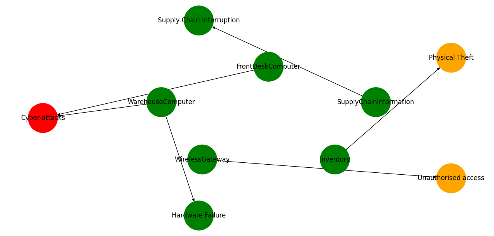
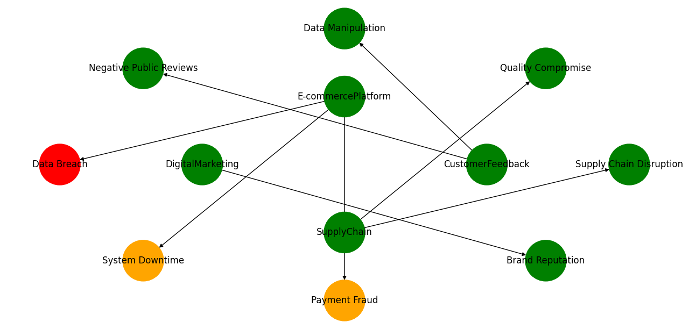

## Threat Profile Evaluation Tool for Pampered Pets

## Introduction 

This tool has been developed to assist 'Pampered Pets' in evaluating their threat profile, relying on the principles of the OCTAVE-S framework for risk analysis. The script analyses the threat landscape based on probability and impact scores, then visualises it in an easy-to-understand format.

## Prerequisites

Before using the tool, ensure you have the following prerequisites:

- **Python 3.x** installed on your system.

- The following Python libraries: **networkx**, **matplotlib**, and **json**. You can install these libraries using **pip**. Open your terminal or command prompt and run the following command:

bash
pip install networkx matplotlib

## Setup & Installation

1. Clone or download the repository to your local machine.

2. Navigate to the directory where the app is located.

3. Ensure the `data/current.json` file is in the correct directory and contains the threat profile in the required JSON format.

## Running the Tool

Navigate to the directory containing the `CurrentState.py` script. Run the following command:

```bash
python currentstate.py
```

Upon execution, the tool will read the data from `data/current.json`, process the threat details, and visualise the threat landscape.

## Understanding the Output

The script produces a graphical representation of the threat landscape. Nodes represent threats, and edges connect them to their relevant categories. The color-coding is as follows:

- Red: Highest risk threats based on Probability x Impact score.

- Orange: Medium risk threats.

- Green: Lower risk threats.

## Design & Structure

The tool's core functionalities are broken down into separate functions:

- `load_attack_tree_from_json`: Loads the threat data from a JSON file.

- `calculate_pi_score`: Calculates the Probability x Impact score for threats.

- `determine_node_colour`: Assigns colors to threats based on their PI score.

- `visualise_attack_tree`: Creates and visualises the threat landscape graph.


## Output Current 




## Output Digitalisation  




